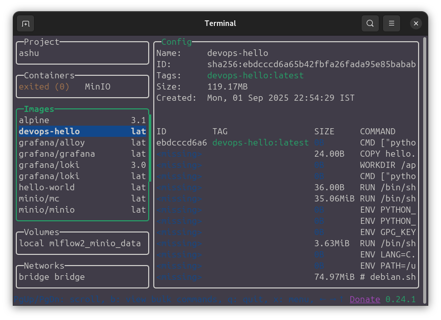
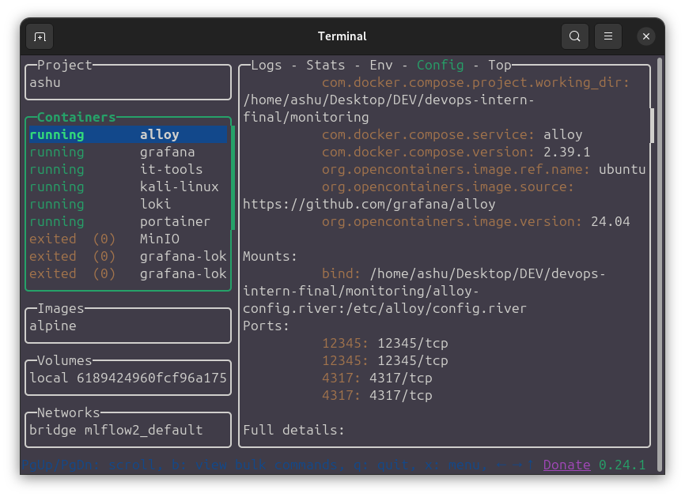
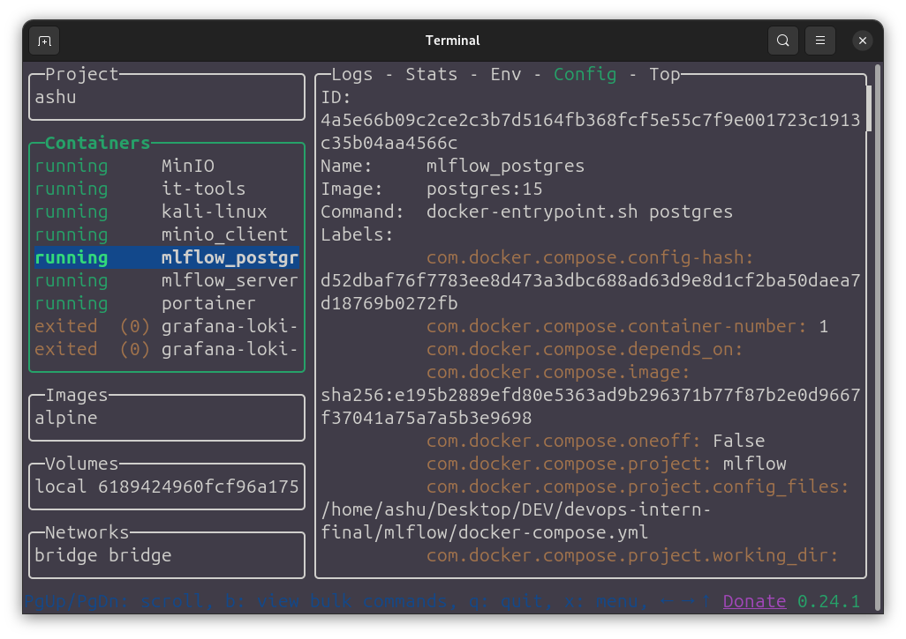
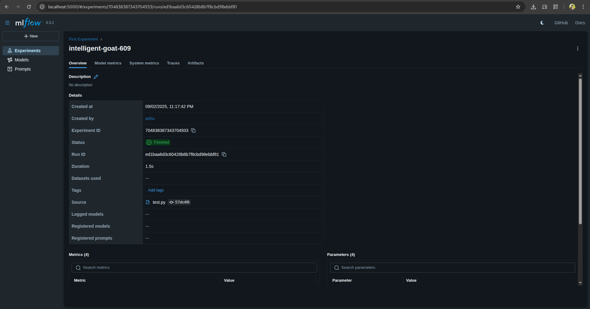
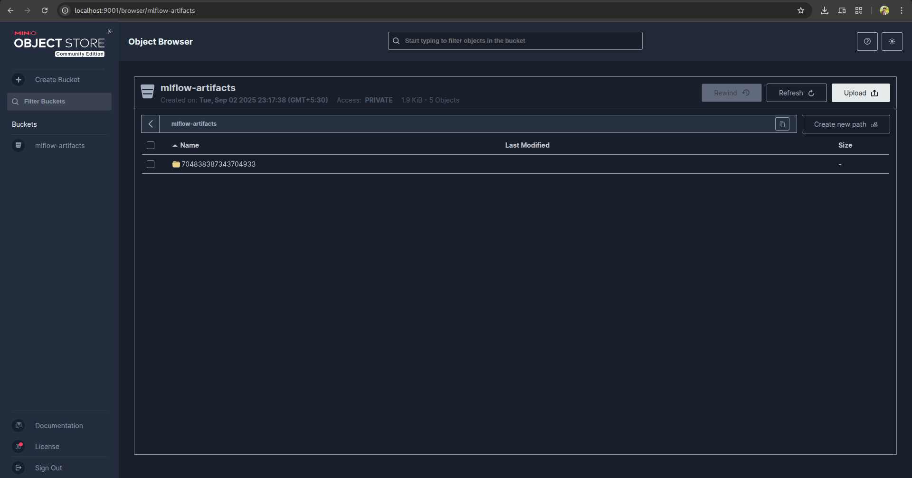
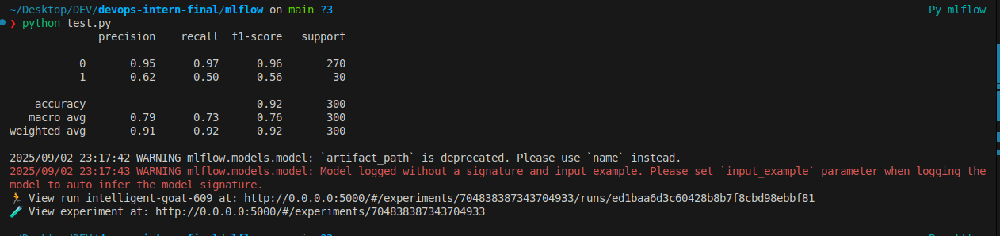

# DevOps Intern Final Assessment

> Name: Ashish Pal

> Date: 01 Sep 2025

### Project Description
This project is for testing my abilities in the following technologies  
- Git & GitHub
- Linux Scripting
- Docker 
- CI/CD
- Nomad
- Documentaion and Clarity

## Linux & Bash Scripting
Created a script inside `script`  folder.  
to make the script executable run `sudo chmod +x scripts/sysinfo.sh`
```bash
== System Info ==
User: ashu
Date: Mon Sep  1 10:50:50 PM IST 2025
Disk Usage:
Filesystem      Size  Used Avail Use% Mounted on
tmpfs           3.1G  5.7M  3.1G   1% /run
/dev/nvme0n1p5   92G   34G   53G  39% /
tmpfs            16G  205M   16G   2% /dev/shm
tmpfs           5.0M   16K  5.0M   1% /run/lock
efivarfs        128K   63K   61K  51% /sys/firmware/efi/efivars
tmpfs            16G     0   16G   0% /run/qemu
/dev/nvme0n1p6  921M  231M  627M  27% /boot
/dev/nvme0n1p3  183G  9.1G  164G   6% /home
/dev/nvme0n1p4  274G   13G  247G   5% /var/lib/docker
/dev/nvme0n1p1  953M  6.2M  946M   1% /boot/efi
tmpfs           3.1G  184K  3.1G   1% /run/user/1000
```

## Docker 
This is a example of containerizing the hello.py we have created.


```bash
 docker build -t devops-hello:latest .
docker run --rm devops-hello:latest

[+] Building 2.4s (8/8) FINISHED                                                                                                                           docker:default
 => [internal] load build definition from Dockerfile                                                                                                                 0.0s
 => => transferring dockerfile: 140B                                                                                                                                 0.0s
 => [internal] load metadata for docker.io/library/python:3.12-slim                                                                                                  2.2s
 => [internal] load .dockerignore                                                                                                                                    0.0s
 => => transferring context: 2B                                                                                                                                      0.0s
 => [1/3] FROM docker.io/library/python:3.12-slim@sha256:d67a7b66b989ad6b6d6b10d428dcc5e0bfc3e5f88906e67d490c4d3daac57047                                            0.0s
 => [internal] load build context                                                                                                                                    0.0s
 => => transferring context: 59B                                                                                                                                     0.0s
 => CACHED [2/3] WORKDIR /app                                                                                                                                        0.0s
 => [3/3] COPY hello.py /app/hello.py                                                                                                                                0.0s
 => exporting to image                                                                                                                                               0.0s
 => => exporting layers                                                                                                                                              0.0s
 => => writing image sha256:ebdcccd6a65b42fbfa26fada95e85babab3f946e3337f3c4f5b909f17bb0fb90                                                                         0.0s
 => => naming to docker.io/library/devops-hello:latest                                                                                                               0.0s


Hello, DevOps!

```


## Github CI/CD
  
This is a exmaple of working CI pipleing build in Github Actions.

## Nomad 
to run the nomad install it from officail documentation and then to start the nomad 
- run `nomad agent -dev`
 
- to run the job run `nomad job run nomad/hello.nomad` which is designed to run the "devops-hello" image


## Monitoring with Grafana Loki

we have our containers running `Loki`,`Alloy` and `Grafana`
to run the container we have used the docker compose cmd `docker compose up -d`
it fetches the logs of docker and display them in grafana.


## MlFlow logging
Running container for mlflow like posgresql,minio for s3 bucket and mlflow server.



Logged a model into the mlflow server and it is displayed in ui.


Bucket created to log the model.


Terminal output when logged a simple model into the tracking system.